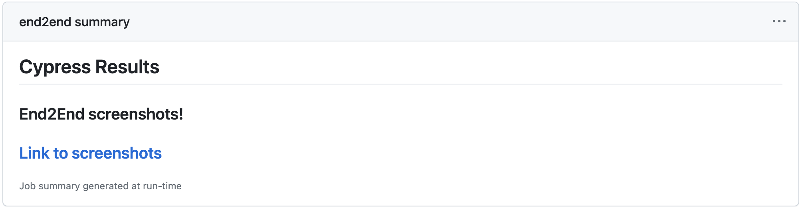

# cypress-error-backup

GitHub action that uploads cypress error screenshots to another github repository and make them available as an artifact on debugging. 

```yaml
uses: devgymbr/cypress-error-backup@v1.0.0
with:
  gh-repo: account/repo
  gh-token: token_with_permissions_to_commit_and_push
```

On the pipeline summary you can see the link to screenshots: 


